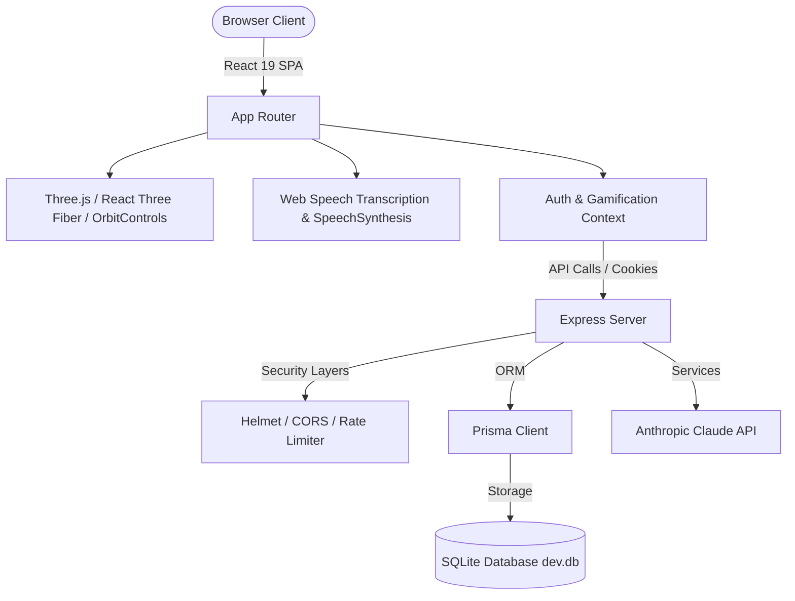

# 🔮 Yaksha's Lair — Vicharanashala FAQ Portal

[](https://www.typescriptlang.org/)
[](https://react.dev/)
[](https://tailwindcss.com/)
[](https://threejs.org/)
[](https://console.groq.com/)
[](https://vitejs.dev/)

Yaksha's Lair is a premium, full-stack, gamified FAQ portal designed for the **Vicharanashala Internship Program at IIT Ropar**. It provides an interactive space theme that transforms flat documentation reading into a gaming-style experience.

---

## 🌌 Feature Matrix

- **⚛️ 3D FAQ Knowledge Graph**: A full-scale interactive coordinate network built in Three.js where FAQ articles float as glowing nodes clustered by category. Hover to inspect tooltips; click nodes to expand cards.
- **🛡️ 3D Yaksha Avatar**: A spinning, dual-layered wireframe sacred geometry shapes core that pulses during AI thinking states and swells during voice transmissions.
- **🔮 Groq AI Oracle**: Dynamic, context-matching AI chatbot powered by Groq's Llama-3.3-70b, fed with internal guidelines regarding NOC policies, stipend conditions, and team setups.
- **🏆 Spurti XP Gamification**: Ranks (Seeker → Scholar → Sage → Oracle), dynamic leveling bars, streaking mechanisms, and a live leaderboard featuring anonymity toggles.
- **🏅 Achievement Reliquary**: Automatic unlocks for items like *First Question*, *Bookworm* (10 bookmarks), *Oracle's Favorite* (50 chat messages), and *FAQ Hunter* (reading all 24 FAQs).
- **🎙️ Speech Synthesis & Recognition**: Real-time microphone capture transcribing spoken inputs and reading response texts back using the browser Web Speech engine, complete with live Canvas waves.
- **📊 Admin Council Panel**: Administrative statistics panels, FAQ compilation models, member contribution reviews, and suggestions moderation queue.

---

## 📐 Architecture Diagram



---

## 🚀 Getting Started

### Prerequisites
- Node.js (v18+)
- NPM

### Installation

1. Navigate to the `Vicharanshala` folder:
   ```bash
   cd Vicharanshala
   ```

2. Install dependencies:
   ```bash
   npm install --legacy-peer-deps
   ```

3. Create the `.env` file:
   ```bash
   cp .env.example .env
   # Add your GROQ_API_KEY and DATABASE_URL inside the .env file
   ```

4. Build and seed the PostgreSQL database:
   ```bash
   npm run setup
   ```

5. Start the development server:
   ```bash
   npm run dev
   ```
   *The backend server boots on port `5000` and the Vite dev server boots on port `5173`.*

---

## 🔌 API Reference Table

| Route | Method | Access | Description |
| :--- | :--- | :--- | :--- |
| `/api/auth/register` | POST | Public | Register new candidate |
| `/api/auth/login` | POST | Public | Authenticate user, issue HTTP-only cookie, check daily login streak |
| `/api/auth/logout` | POST | Authenticate | Invalidate session |
| `/api/faqs` | GET | Public | Fetch all FAQs ordered by popularity index |
| `/api/faqs` | POST | Admin | Add new FAQ article |
| `/api/faqs/:id` | PATCH | Admin | Update existing FAQ |
| `/api/faqs/:id/vote` | POST | Authenticate | Cast upvote/downvote (+2 SP on upvote) |
| `/api/faqs/:id/bookmark` | POST | Authenticate | Toggle saved bookmarks (+3 SP) |
| `/api/faqs/suggest` | POST | Authenticate | Submit QA suggestion for queue review |
| `/api/chat` | POST | Authenticate | Talk to Yaksha AI (Rate limited: 15/min, +10 SP) |
| `/api/user/spurti` | GET | Authenticate | Fetch user XP, rank limits, recent logs, evaluate badges |
| `/api/user/activity` | POST | Authenticate | Log user actions (Read FAQ: +5 SP) |
| `/api/leaderboard` | GET | Public | Fetch top rankings (Masks usernames by default) |
| `/api/admin/stats` | GET | Admin | Aggregate registrations, FAQ count, and today's chat queries |
| `/api/admin/queue` | GET | Admin | Retrieve community suggestions queue |
| `/api/admin/queue/:id/approve`| POST| Admin | Approve suggestion, create FAQ, award author +50 SP |

---

## 🔒 Security Configuration

- **Helmet**: Secures headers and defines strict Content Security Policy directives to block cross-site scripting.
- **HTTP-Only Cookies**: JWT authentication tokens are stored in `httpOnly` secure cookies to prevent XSS-based session hijacking.
- **Express-Rate-Limit**: Throttles bot spamming. The `/api/chat` router blocks queries exceeding 15 calls per minute.
- **Bcrypt**: Hashes passwords using 10 salt rounds.
- **requireAdmin Middleware**: Blocks non-administrators from accessing statistics or modifying FAQs.

---

## 🎨 Visual Identity Guidelines

- **Theme**: Dark Space only (`#050510` deep space canvas).
- **Accents**: Violet (`#7C3AED`) and Cyan (`#06B6D4`).
- **Glow**: Transparent overlay glows in blur containers.
- **Typography**: Heading tags styled in `Space Grotesk`, UI labels and body texts styled in `Inter`.

---

## 🛳️ Deployment Guide

### Deploying to Production (Render/Heroku/Vercel)

1. Configure environment variables in host provider dashboard:
   - `NODE_ENV=production`
   - `PORT=8080`
   - `DATABASE_URL=file:./prod.db`
   - `JWT_SECRET=production_random_secret_string`
   - `ANTHROPIC_API_KEY=your_live_claude_key`

2. Compile client resources and server:
   ```bash
   npm run build
   ```

3. Perform database push:
   ```bash
   npx prisma db push --accept-data-loss
   npx tsx prisma/seed.ts
   ```

4. Launch application server:
   ```bash
   npm run start
   ```

---

*Built by Vicharanshala interns for Vicharanashala Summer 2026.*
